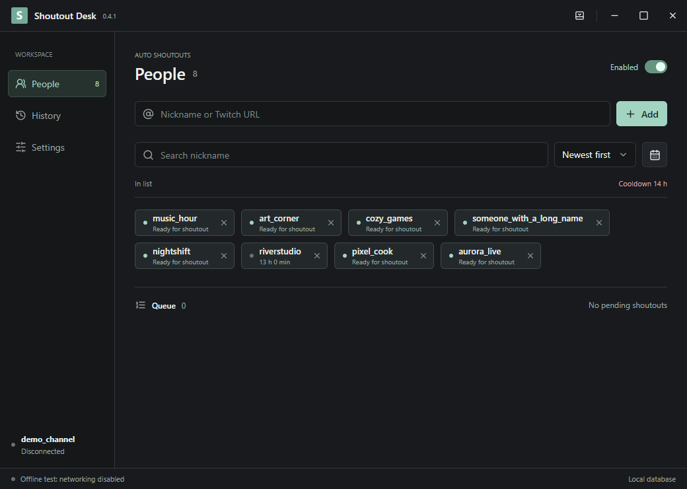
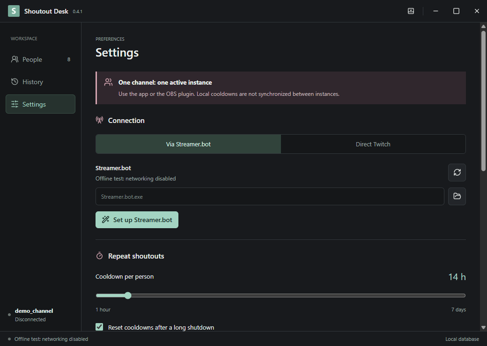
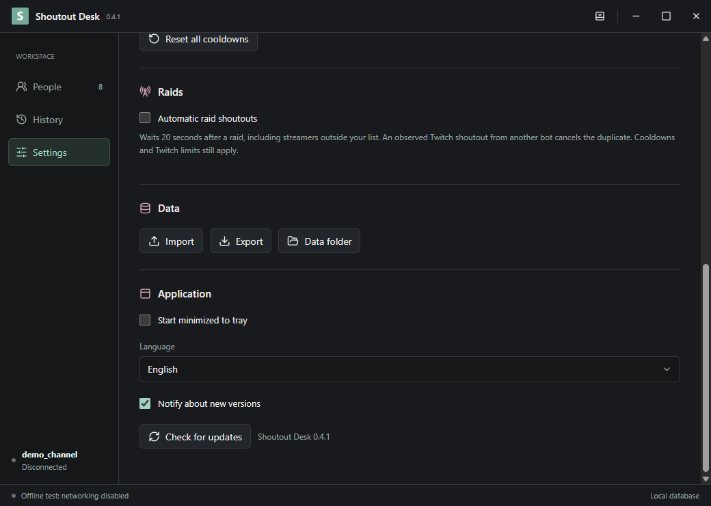
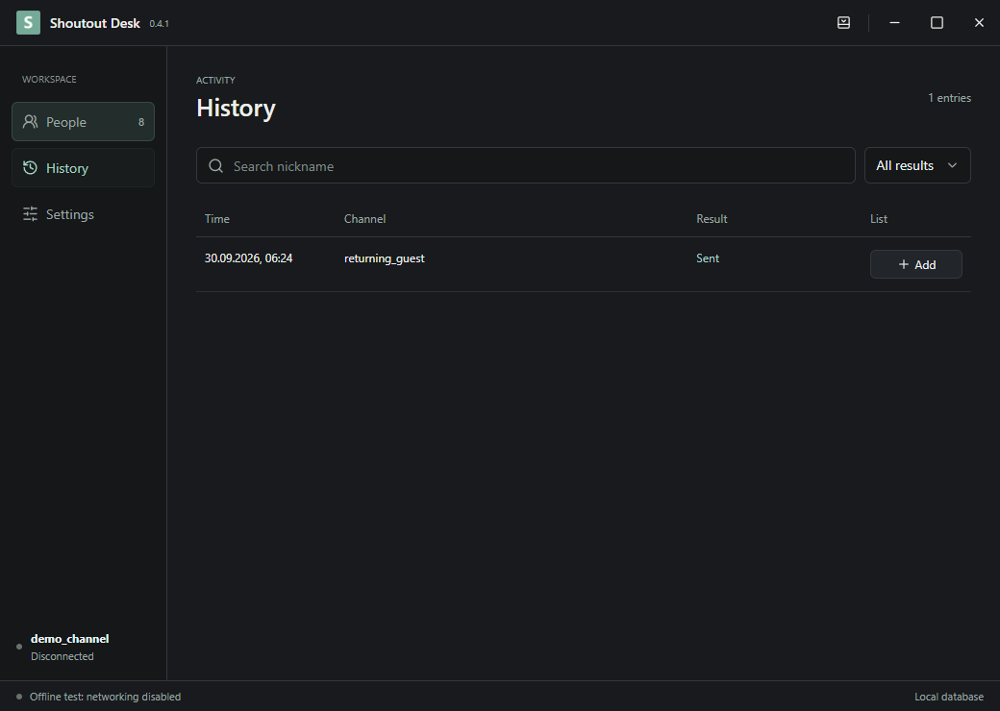

# Shoutout Desk

**Sign-in fix in 0.4.1:** temporary Twitch and network failures recover automatically. Only invalid authorization displays the sign-in banner and a Windows notification (when allowed). People, history and cooldowns are preserved.

[English](README.md) | [Українська](README.uk.md) | [Русский](README.ru.md)

A small Windows app that sends a Twitch shoutout when a person from your list writes in chat after their cooldown expires.

**[Download and install](https://github.com/foolka/shoutout-desk/releases/latest)**: Windows EXE + ZIP.

**Already using an older version? [Read this before updating: keep or import your local database](#legacy-import).**



Screenshots use fictional accounts. No personal profiles are included.

## Contents

- [Import a database from the first versions](#legacy-import)
- [Download and install](#install)
- [Setup](#setup)
- [Settings and controls](#settings)
- [Updates and portable mode](#updates)
- [Data and privacy](#privacy)
- [Screenshots](#screenshots)
- [Build from source](#build)

<a id="install"></a>
## Download and install

Windows 10/11 x64. Download the **setup.exe** from Releases, close Shoutout Desk, and run it. Installation is per Windows user and does not need administrator rights. Start it from the new Start menu shortcut. The installer does not start a stream or launch the app automatically.

<a id="legacy-import"></a>
## Import a database from the first versions

A normal update on the same Windows profile preserves your data automatically: close the program and install over the old version. Import is only needed when switching profiles/computers or moving between the desktop app and OBS plugin.

1. In the old program, open **Settings > Data folder**. Export JSON if that button is available; otherwise find **`shoutouts.sqlite`**. The desktop app normally uses `%APPDATA%\Shoutout Desk`; portable mode uses `ShoutoutDesk-data` next to its EXE.
2. Close the old app/OBS normally, then back up the **whole data folder**. Copying an open SQLite database without its WAL can lose recent records.
3. Open the new version and connect the **same Twitch broadcaster account**.
4. Choose **Settings > Import** and select the JSON export or **`shoutouts.sqlite`**, including databases from the earliest releases. Do not select `connection.json`, an authorization file, or the EXE.
5. People, history and cooldowns are **merged**, not replaced; importing again does not duplicate the same history. Pending actions are not replayed. Automation pauses after import: check the result and enable it when ready.

Authorization is not imported. Keep the backup until you verify the result. The new database uses schema 3; to downgrade, restore a backup made before the upgrade instead of opening the migrated database with an old version.

<a id="setup"></a>
## Setup

1. In Settings choose **Twitch directly** or **Streamer.bot**.
2. Direct: press **Sign in with Twitch**, confirm the code on the official Twitch page, and allow access to your own broadcaster account. A Public Client ID is already included; no registration is needed.
3. Streamer.bot: first sign in to Twitch as the broadcaster in Streamer.bot 1.0.7. Press **Set up Streamer.bot**; the running copy is detected, or select its EXE. If asked, exit the bot from its tray menu and press the setup button again. The bot is restarted after setup. OBS does not need to close.
4. Add Twitch nicknames or profile links. When your channel is live, a fresh message from a listed person can queue a shoutout.

Run **one active instance per channel**: either this app or the OBS plugin. Separate computers do not share cooldown databases. A shoutout observed from another bot updates the local cooldown and cancels a queued duplicate. Events must reach this instance; this cannot reconstruct shoutouts from before it was connected.

<a id="settings"></a>
## Settings and controls

| Control | Action |
| --- | --- |
| Shout out incoming raiders | Off by default. Queue incoming raiders for at least 20 seconds; observe other bots and respect cooldowns. See below. |
| Notify about new versions | On by default. Background GitHub checks and a release banner; no automatic installation. |
| Enabled | Pause/resume automation for this run. It is enabled again on every launch; this does not reset personal cooldowns. |
| Cooldown, 1–168 hours | Minimum interval per person in this channel. Default: 24 h. Expiry alone sends nothing: a new chat message is required. |
| Reset after long shutdown | Off by default. If closed for strictly more than 60 minutes, reset personal cooldowns on next launch. History remains. Crash recovery includes a 30-second heartbeat allowance. |
| Reset all cooldowns | Requires confirmation. Resets this channel only, keeps people/history and clears queued work. Twitch limits and the local global gap still apply. |
| Connection method | Switch between local Streamer.bot and direct Twitch. Your channel data stays. Another account has its own list and history. |
| Sign in / sign out | Connect your broadcaster account. Sign out removes saved Twitch authorization, not the list/history. |
| Set up Streamer.bot | Backs up actions/settings in the bot's backup directory; installs an authenticated local bridge and enables WebSocket autostart. Preserves its port/password and other actions. Unknown schemas/public bindings are refused. OBS and desktop bridges use different action IDs. |
| Reconnect | Re-establish the selected connection. Does not replay old chat or reset cooldowns. |
| Add / X | Add a nickname or Twitch profile URL; X removes it from the active list, preserving history/cooldown. Duplicates are merged. |
| Search / sort / date | Filter visible people by nickname/date added; sort newest, oldest or name. Does not change who is enabled. |
| History / Add | Shows outcomes and errors. Add restores a person missing from the list without issuing a shoutout. |
| Import | Merge a JSON export or an old shoutouts.sqlite from the same channel. Sign in/connect first. Back up before merging; pause automation. Pending requests are not replayed. Close the source program before copying SQLite. |
| Export | Write a new JSON file with this channel's people, history, cooldown data. No tokens, passwords or bot connection secrets. |
| Data folder | Open the active profile, including automatic backups. Do not publish its contents. |
| Language | English, Ukrainian or Russian. Some diagnostic messages may remain Russian. |
| Check for updates | Manual GitHub release check. A newer stable release can be opened in your browser. No silent downloads or installation. Twitch credentials are not sent to GitHub. |
| Start minimized to tray | Hide the window on launch while automation stays running. This is not Windows autostart. |
| Tray / minimize / maximize / close | Tray hides the window; a double-click restores it. Minimize uses the taskbar. Close/Exit stops the application. |

**Outcomes:** Sent = confirmed by Twitch; Queued/Sending = pending; Skipped = cancelled or no longer eligible; Error = definite rejection; Unconfirmed = outcome unknown, so automatic resend is blocked for the personal cooldown. There is a 10-second settling window for other bots' events and a 125-second local gap between channel shoutouts. No stream is started by this software.

<a id="updates"></a>
### Incoming raids

**Shout out incoming raiders** is off by default. When enabled, an incoming raid during a live stream queues its streamer for **at least 20 seconds**, even if they are not in your saved list. It does not add them to the list. Personal cooldowns, the 125-second channel gap and Twitch limits can postpone or prevent sending.

An actual Twitch shoutout observed from another bot during the wait cancels the duplicate. A plain chat message or a text-only `!so` command is not a Twitch shoutout event. This protection requires a working connection; independent bots cannot be coordinated with an absolute guarantee.

### Update notifications

**Notify about new versions** is on by default. The first background check starts about 15 seconds after launch; successful checks are at most once per day. Offline failures remain quiet and can retry later. A new stable release displays a banner; the desktop app can also show a Windows notification. Nothing is downloaded or installed automatically. Manual **Check for updates** works even with background checks disabled.

**Older releases cannot receive this new automatic notification feature remotely. Update once manually**, then future versions can be announced. Checks contact the public GitHub Releases API and never send Twitch credentials.

## Updates and portable mode

Use **Check for updates**, exit the app and run the new installer over the old version. Lists, history and protected sign-in stay in `%APPDATA%\Shoutout Desk`.

**ZIP / no installation:** extract the full archive and run `ShoutoutDesk.exe`. It uses the same Windows profile as the installed app, so replacing program files preserves your data. Never run two copies for one channel.

**Fully portable data:** run `Portable.cmd` instead. Its separate profile is `ShoutoutDesk-data` next to the EXE. Use that launcher consistently. On update, close the app and replace only program files; keep `ShoutoutDesk-data`. The ZIP contains no database. Use Export/Import to move a list between profiles. Encrypted sign-in is tied to Windows user/machine; sign in again on a different computer.

<a id="privacy"></a>
## Data and privacy

Everything runs locally. No account on our server is created. Twitch sign-in uses the official Device Code flow with `user:read:chat` and `moderator:manage:shoutouts`; the latter is the API permission name, not a moderator mode. OAuth tokens and bridge credentials are encrypted with Windows protection. JSON exports contain public nicknames and activity timestamps; share them only intentionally. Twitch receives chat subscriptions/shoutout requests; GitHub is contacted when you check updates. Backups remain local.

EXE/ZIP binaries are attached to **GitHub Releases**, not committed into source history. These builds are not code-signed; Windows may show a reputation warning. Check the repository and SHA256 rather than disabling system protection.

<a id="screenshots"></a>
## Screenshots







<a id="build"></a>
## Build from source

Windows x64, Node.js 24.14+, Inno Setup 6.7.3 (`ISCC_EXE`). Electron is downloaded by the build tools.

```powershell
npm ci
npm run audit:source
npm test
npm run build
npm run test:ui
$env:ISCC_EXE = 'C:\Tools\Inno Setup 6\ISCC.exe'
npm run installer
npm run package
```

GPL-2.0-or-later. [License](LICENSE) · [Security](SECURITY.md) · [Third-party notices](THIRD_PARTY_NOTICES.md)

Technical references: [Twitch OAuth](https://dev.twitch.tv/docs/authentication/getting-tokens-oauth/#device-code-grant-flow), [Streamer.bot WebSocket](https://docs.streamer.bot/api/websocket), [OBS portable mode](https://obsproject.com/kb/portable-mode).
