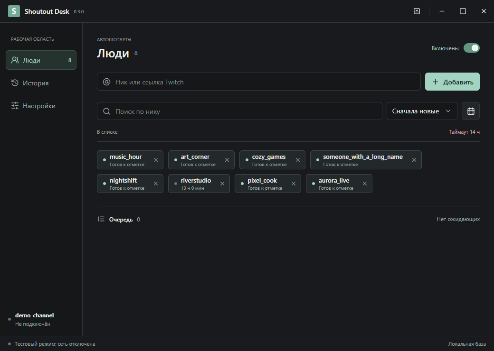
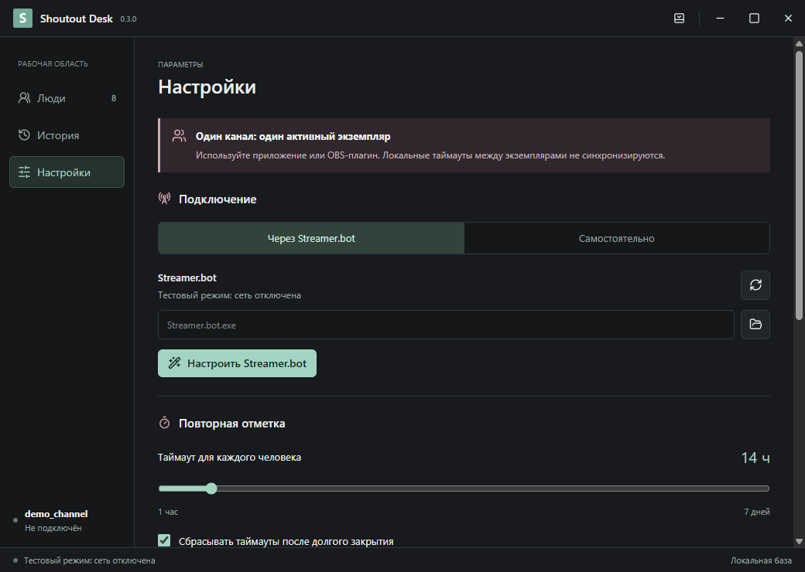
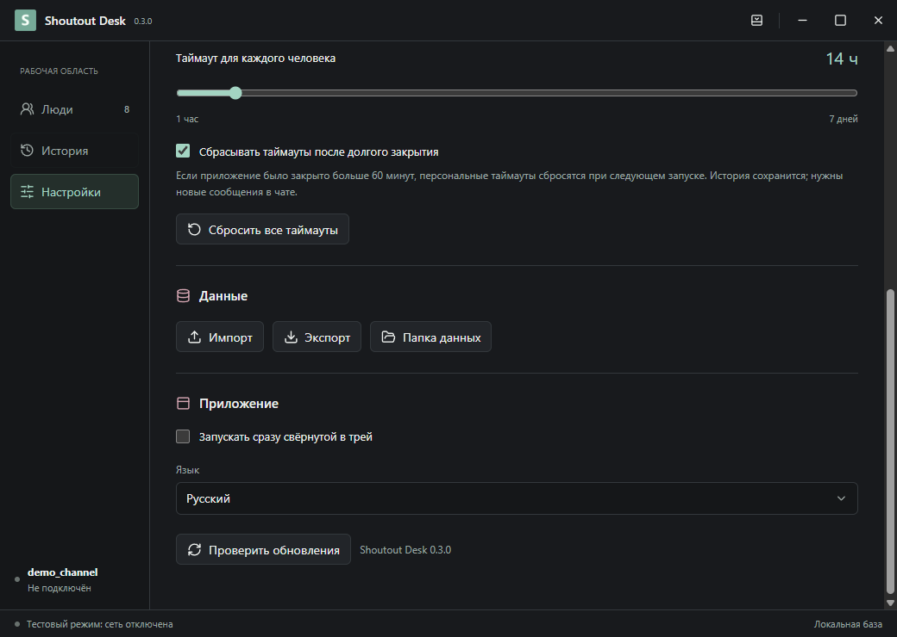
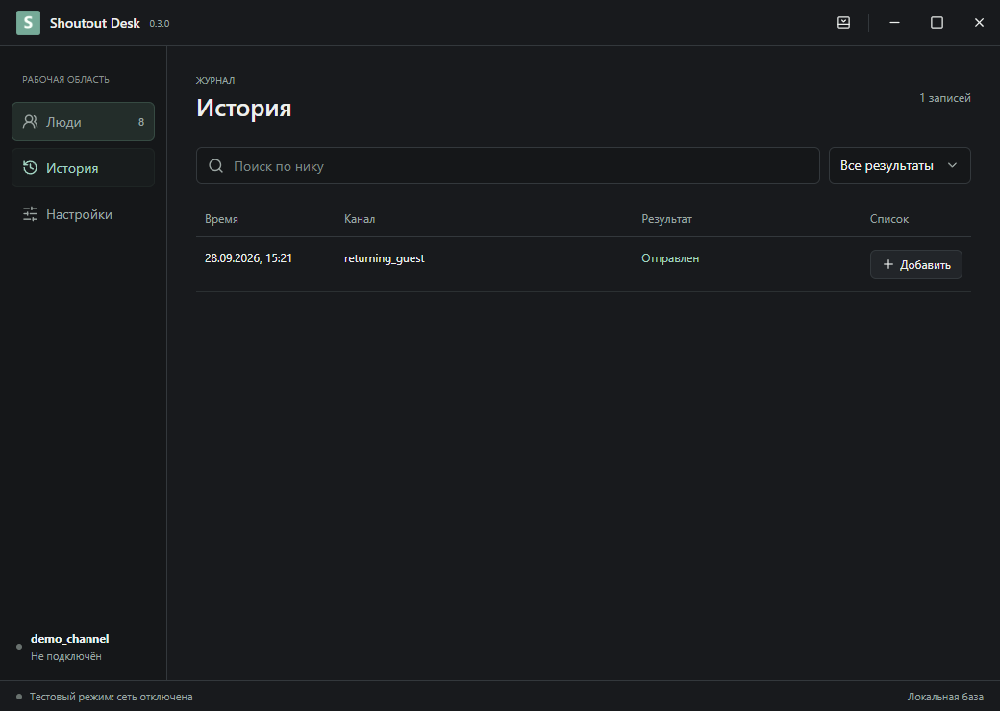

# Shoutout Desk

[English](README.md) | [Українська](README.uk.md) | [Русский](README.ru.md)

Небольшое Windows-приложение: отмечает человека из вашего списка, когда он пишет в чат после истечения таймаута.

**[Скачать и установить](https://github.com/foolka/shoutout-desk/releases/latest)**: Windows EXE + ZIP.



На скриншотах вымышленные аккаунты. Личных профилей в поставке нет.

## Оглавление

- [Скачать и установить](#install)
- [Настройка](#setup)
- [Настройки и кнопки](#settings)
- [Обновления и portable](#updates)
- [Данные и приватность](#privacy)
- [Скриншоты](#screenshots)
- [Сборка из исходников](#build)

<a id="install"></a>
## Скачать и установить

Windows 10/11 x64. Скачайте **setup.exe** из Releases, закройте Shoutout Desk и запустите установщик. Установка для текущего пользователя Windows, права администратора не нужны. Затем откройте приложение из меню «Пуск». Установщик не запускает приложение или трансляцию автоматически.

<a id="setup"></a>
## Настройка

1. В настройках выберите **Twitch напрямую / Самостоятельно** или **Streamer.bot**.
2. Напрямую: нажмите **Войти через Twitch**, подтвердите код на официальной странице Twitch и разрешите доступ к своему аккаунту стримера. Public Client ID уже включён, регистрировать приложение не нужно.
3. Streamer.bot: сначала подключите аккаунт стримера к Twitch в Streamer.bot 1.0.7. Нажмите **Настроить Streamer.bot**: запущенная копия определится автоматически, либо выберите EXE. Если появится просьба закрыть бота, выйдите через меню трея и повторите настройку. После настройки бот запустится снова. OBS закрывать не нужно.
4. Добавьте ники или ссылки на профили Twitch. Во время эфира новое сообщение человека из списка может поставить его в очередь на отметку.

На канал нужен **один активный экземпляр**: приложение или OBS-плагин. Между компьютерами базы таймаутов не синхронизируются. Если получено событие шотаута от другого бота, оно обновляет таймаут и отменяет дубль в очереди. Событие должно прийти подключённому экземпляру: прошлые шотауты до подключения автоматически не восстанавливаются.

<a id="settings"></a>
## Настройки и кнопки

| Настройка или кнопка | Действие |
| --- | --- |
| Включены | Пауза/возобновление автоотметок до закрытия. При каждом запуске снова включены; персональные таймауты от этого не сбрасываются. |
| Таймаут, 1–168 часов | Минимальный интервал для каждого человека в этом канале. По умолчанию 24 ч. После истечения нужно новое сообщение, автоматической массовой отправки нет. |
| Сбрасывать после долгого закрытия | По умолчанию выключено. Если программа была закрыта строго больше 60 минут, при запуске сбросятся персональные таймауты. История останется. При аварийном закрытии учитывается запас heartbeat 30 секунд. |
| Сбросить все таймауты | С подтверждением. Только текущий канал; список и история остаются, очередь очищается. Лимиты Twitch и общий интервал отправки продолжают действовать. |
| Способ подключения | Streamer.bot или Twitch напрямую. Данные канала сохраняются; у другого аккаунта свой список и история. |
| Войти / выйти | Авторизация своего аккаунта стримера. Выход удаляет сохранённый вход Twitch, но не список и историю. |
| Настроить Streamer.bot | Создаёт резервную копию actions/settings в backup бота, локальную связку с секретом и автозапуск WebSocket. Сохраняет порт, пароль и остальные действия. Неизвестные форматы и публичные сетевые адреса отклоняются. У приложения и OBS разные ID действий. |
| Переподключиться | Восстановить выбранное соединение. Старые сообщения не переигрываются, таймауты не сбрасываются. |
| Добавить / крестик | Ник или ссылка Twitch. Крестик убирает из активного списка, сохраняя историю и таймаут. Дубликаты объединяются. |
| Поиск / сортировка / дата | Фильтруют отображение по нику и дате добавления; сортировка от новых, старых или по нику. Не выключают людей из автоотметок. |
| История / Добавить | Результаты и ошибки. Кнопка возвращает отсутствующего человека в список без отправки шотаута. |
| Импорт | Объединяет JSON-экспорт или старый shoutouts.sqlite того же канала. Сначала подключитесь. До импорта создаётся бэкап; автоотметки ставятся на паузу. Незавершённые запросы не отправляются заново. Перед копированием SQLite закройте исходную программу. |
| Экспорт | Новый JSON со списком, историей и таймаутами этого канала. Токены, пароли и секрет связки не экспортируются. |
| Папка данных | Текущий профиль и резервные копии. Не публикуйте содержимое. |
| Язык | Украинский, русский, английский. Отдельные диагностические сообщения могут оставаться на русском. |
| Проверить обновления | Ручная проверка стабильного релиза GitHub. Можно открыть новую версию в браузере. Без скрытой загрузки/установки; токены Twitch в GitHub не отправляются. |
| Запускать свёрнутой в трей | Окно скрывается при запуске, автоотметки продолжают работать. Это не автозапуск с Windows. |
| Трей / свернуть / развернуть / закрыть | Трей скрывает окно; двойной клик по значку возвращает его. Свернуть использует панель задач. Закрыть/Выход завершает программу. |

**Статусы:** Отправлен: подтверждено Twitch; В очереди/Отправляется: ожидание; Пропущен: отменён или больше не подходит; Ошибка: получен отказ; Нет подтверждения: исход неизвестен, повтор заблокирован на персональный таймаут. Перед отправкой есть окно 10 секунд для событий других ботов и общий интервал 125 секунд между отметками канала. Программа никогда не запускает стрим.

<a id="updates"></a>
## Обновления и portable

Нажмите **Проверить обновления**, выйдите из приложения и установите новую версию поверх старой. Список, история и защищённый вход остаются в `%APPDATA%\Shoutout Desk`.

**ZIP / без установки:** распакуйте целиком и запустите `ShoutoutDesk.exe`. Он использует тот же профиль Windows, что установленное приложение: обновление файлов программы сохраняет базу. Не запускайте две копии на один канал.

**Полностью переносимые данные:** запускайте `Portable.cmd`. Его отдельный профиль `ShoutoutDesk-data` находится рядом с EXE. Пользуйтесь этим запуском постоянно. При обновлении закройте приложение, замените файлы программы, но сохраните `ShoutoutDesk-data`. В архиве базы нет. Для переноса списка между профилями используйте Экспорт/Импорт. Защищённый вход привязан к Windows: на другом компьютере войдите снова.

<a id="privacy"></a>
## Данные и приватность

Всё работает локально. Аккаунт на нашем сервере не создаётся. Вход Twitch через официальный Device Code flow: `user:read:chat` и `moderator:manage:shoutouts`; последнее является названием разрешения API, а не режимом модератора. Токены OAuth и секреты связки зашифрованы средствами Windows. JSON-экспорт содержит ники и время активности: делитесь им осознанно. Twitch получает подписки на чат и запросы отметок, GitHub вызывается при проверке обновлений. Бэкапы остаются локально.

EXE и ZIP находятся в **GitHub Releases**, исходники хранятся отдельно без бинарников. Сборки не подписаны сертификатом: Windows может показывать предупреждение репутации. Проверяйте репозиторий и SHA256, не отключайте системную защиту.

<a id="screenshots"></a>
## Скриншоты







<a id="build"></a>
## Сборка из исходников

Windows x64, Node.js 24.14+, Inno Setup 6.7.3 (`ISCC_EXE`). Инструменты сборки сами загружают Electron.

```powershell
npm ci
npm run audit:source
npm test
npm run build
npm run test:ui
$env:ISCC_EXE = 'C:\Tools\Inno Setup 6\ISCC.exe'
npm run installer
npm run package
```

GPL-2.0-or-later. [License](LICENSE) · [Security](SECURITY.md) · [Third-party notices](THIRD_PARTY_NOTICES.md)

Technical references: [Twitch OAuth](https://dev.twitch.tv/docs/authentication/getting-tokens-oauth/#device-code-grant-flow), [Streamer.bot WebSocket](https://docs.streamer.bot/api/websocket), [OBS portable mode](https://obsproject.com/kb/portable-mode).
