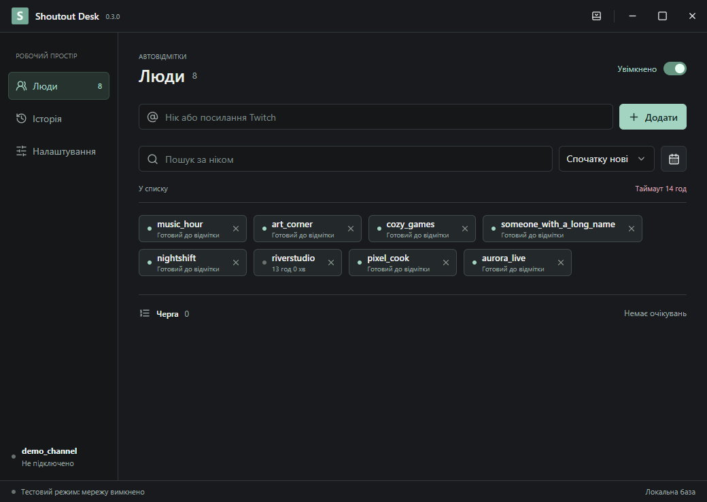
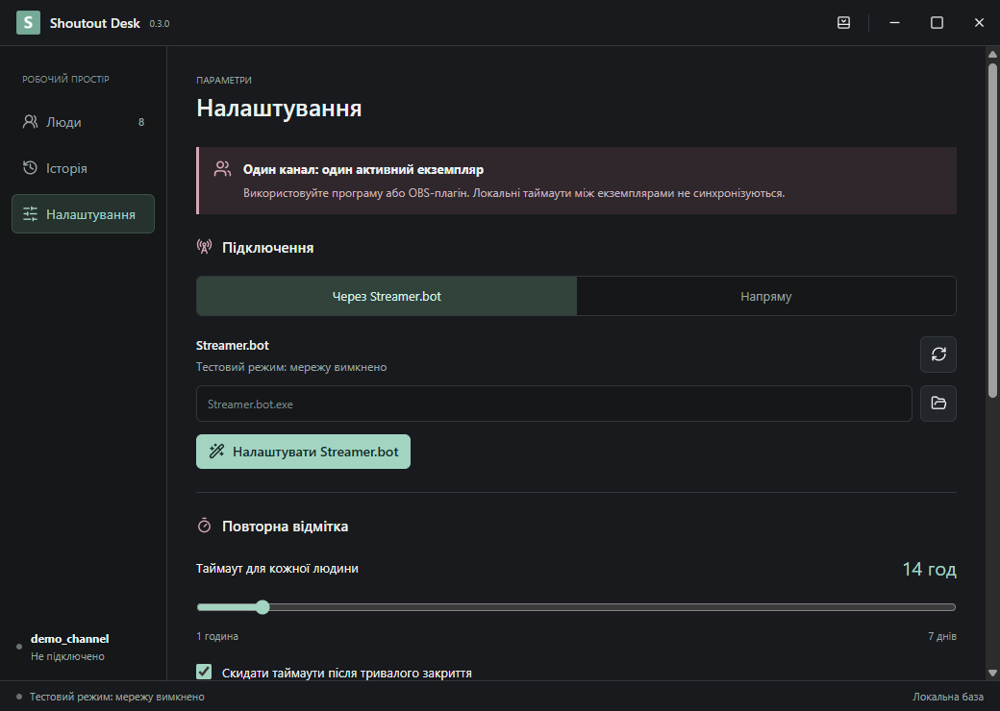
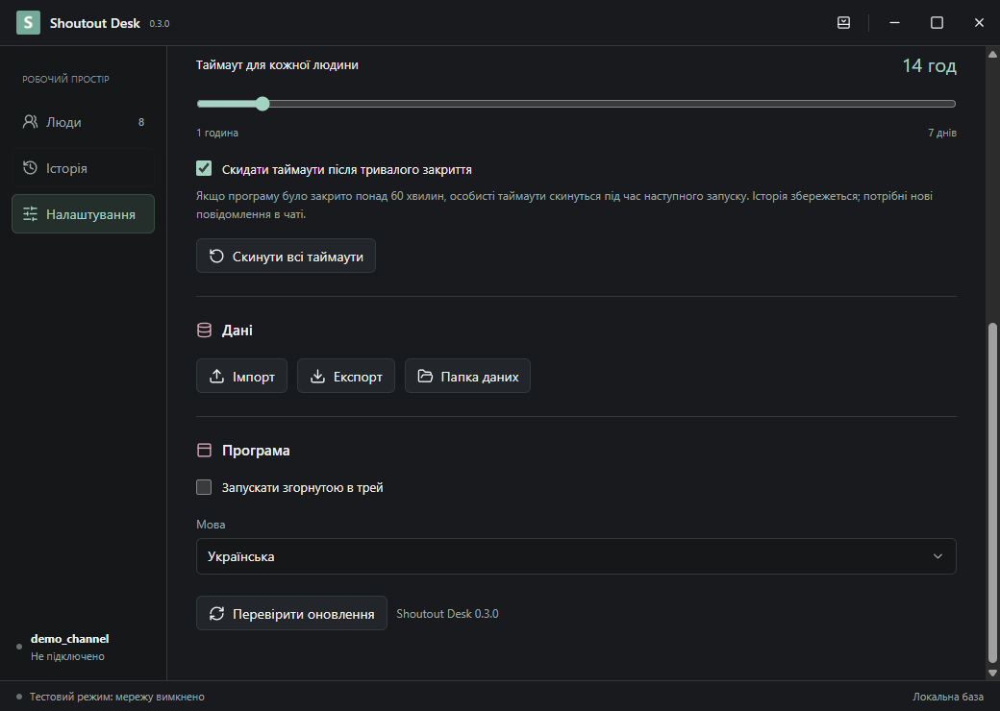
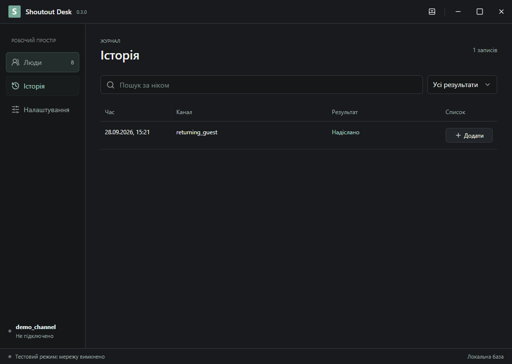

# Shoutout Desk

[English](README.md) | [Українська](README.uk.md) | [Русский](README.ru.md)

Невелика Windows-програма: відмічає людину зі списку, коли вона пише в чат після завершення таймауту.

**[Завантаження та встановлення](https://github.com/foolka/shoutout-desk/releases/latest)**: Windows EXE + ZIP.



На знімках вигадані акаунти. Особистих профілів у пакеті немає.

## Зміст

- [Завантаження та встановлення](#install)
- [Налаштування](#setup)
- [Параметри та кнопки](#settings)
- [Оновлення та portable](#updates)
- [Дані та приватність](#privacy)
- [Знімки екрана](#screenshots)
- [Збирання з вихідного коду](#build)

<a id="install"></a>
## Завантаження та встановлення

Windows 10/11 x64. Завантажте **setup.exe** з Releases, закрийте Shoutout Desk та запустіть інсталятор. Встановлення для поточного користувача Windows, права адміністратора не потрібні. Відкрийте програму з меню «Пуск». Інсталятор не запускає програму або трансляцію автоматично.

<a id="setup"></a>
## Налаштування

1. У налаштуваннях виберіть **Twitch напряму** або **Streamer.bot**.
2. Напряму: натисніть **Увійти через Twitch**, підтвердьте код на офіційній сторінці Twitch та дозвольте доступ до власного акаунта стримера. Public Client ID вже включено; реєструвати застосунок не потрібно.
3. Streamer.bot: спочатку підключіть акаунт стримера до Twitch у Streamer.bot 1.0.7. Натисніть **Налаштувати Streamer.bot**: запущена копія визначиться автоматично, або виберіть EXE. Якщо потрібно, вийдіть із бота через меню трея та повторіть налаштування. Після цього бот запуститься знову. OBS закривати не потрібно.
4. Додайте ніки або посилання Twitch. Під час ефіру нове повідомлення людини зі списку може поставити її в чергу на відмітку.

На канал потрібен **один активний екземпляр**: програма або OBS-плагін. Бази між комп’ютерами не синхронізуються. Отримана подія шотауту іншого бота оновлює таймаут і скасовує дубль у черзі. Подія має надійти підключеному екземпляру: попередня історія до підключення автоматично не відновлюється.

<a id="settings"></a>
## Параметри та кнопки

| Налаштування або кнопка | Дія |
| --- | --- |
| Увімкнено | Пауза/відновлення автовідміток до закриття. Під час кожного запуску знову ввімкнено; персональні таймаути не скидаються. |
| Таймаут, 1–168 годин | Мінімальний інтервал для кожної людини в цьому каналі. Типово 24 год. Після завершення потрібне нове повідомлення; масового надсилання немає. |
| Скидати після тривалого закриття | Типово вимкнено. Якщо програму закрито строго понад 60 хвилин, таймаути скинуться під час запуску. Історія збережеться. Після аварійного закриття враховується запас heartbeat 30 секунд. |
| Скинути всі таймаути | З підтвердженням. Лише поточний канал; люди й історія зберігаються, черга очищується. Обмеження Twitch і загальний інтервал залишаються. |
| Спосіб підключення | Streamer.bot або Twitch напряму. Дані каналу зберігаються; інший акаунт має окремий список та історію. |
| Увійти / вийти | Авторизація власного акаунта стримера. Вихід видаляє збережений вхід Twitch, але не людей чи історію. |
| Налаштувати Streamer.bot | Резервна копія actions/settings у backup бота, локальний міст із секретом та автозапуск WebSocket. Зберігає порт, пароль та інші дії. Невідомі формати і публічні мережеві адреси відхиляються. Програма й OBS мають різні ID дій. |
| Перепідключитися | Відновити вибране з’єднання. Старі повідомлення не повторюються, таймаути не скидаються. |
| Додати / хрестик | Нік або посилання Twitch. Хрестик прибирає з активного списку, зберігаючи історію й таймаут. Дублі об’єднуються. |
| Пошук / сортування / дата | Фільтрують відображення за ніком і датою додавання, сортують за новими, старими або ніком. Не вимикають людей з автовідміток. |
| Історія / Додати | Результати й помилки. Кнопка повертає відсутню людину до списку без надсилання шотауту. |
| Імпорт | Об’єднує JSON-експорт або старий shoutouts.sqlite того самого каналу. Спочатку підключіться. Перед імпортом створюється копія; автовідмітки ставляться на паузу. Незавершені запити не надсилаються знову. Перед копіюванням SQLite закрийте початкову програму. |
| Експорт | Новий JSON із людьми, історією та таймаутами каналу. Токени, паролі й секрет моста не експортуються. |
| Папка даних | Поточний профіль і резервні копії. Не публікуйте їх. |
| Мова | Українська, російська, англійська. Окремі діагностичні повідомлення можуть залишатися російською. |
| Перевірити оновлення | Ручна перевірка стабільного релізу GitHub. Нову версію можна відкрити у браузері. Без прихованого завантаження/встановлення; токени Twitch не надсилаються в GitHub. |
| Запускати згорнутою в трей | Приховати вікно під час запуску, продовжуючи автовідмітки. Це не автозапуск із Windows. |
| Трей / згорнути / розгорнути / закрити | Трей приховує вікно, подвійний клік повертає його. Згорнути використовує панель завдань. Закрити/Вихід завершує програму. |

**Статуси:** Надіслано: підтверджено Twitch; У черзі/Надсилається: очікування; Пропущено: скасовано або більше не підходить; Помилка: відмова; Без підтвердження: результат невідомий, повтор заблоковано на особистий таймаут. Перед надсиланням є 10 секунд для подій інших ботів і загальний інтервал 125 секунд між відмітками каналу. Програма ніколи не запускає стрим.

<a id="updates"></a>
## Оновлення та portable

Натисніть **Перевірити оновлення**, вийдіть із програми та встановіть нову версію поверх старої. Люди, історія й захищений вхід залишаться у `%APPDATA%\Shoutout Desk`.

**ZIP / без встановлення:** розпакуйте повністю та запустіть `ShoutoutDesk.exe`. Він використовує той самий профіль Windows, що встановлена програма: заміна програмних файлів зберігає базу. Не запускайте дві копії на один канал.

**Повністю переносимі дані:** запускайте `Portable.cmd`. Окремий профіль `ShoutoutDesk-data` буде поруч із EXE. Користуйтеся цим запуском постійно. При оновленні закрийте програму, замініть програмні файли, але збережіть `ShoutoutDesk-data`. Архів не містить бази. Для перенесення списку між профілями використовуйте Експорт/Імпорт. Захищений вхід прив’язаний до Windows: на іншому ПК увійдіть знову.

<a id="privacy"></a>
## Дані та приватність

Усе працює локально. Акаунт на нашому сервері не створюється. Вхід Twitch через офіційний Device Code flow: `user:read:chat` і `moderator:manage:shoutouts`; останнє є назвою дозволу API, а не режимом модератора. Токени OAuth і секрети моста зашифровані засобами Windows. JSON-експорт містить ніки й час активності: діліться ним свідомо. Twitch отримує підписки на чат і запити відміток, GitHub викликається при перевірці оновлень. Копії залишаються локально.

EXE і ZIP розміщуються у **GitHub Releases**, код зберігається окремо без бінарників. Збірки не підписані сертифікатом: Windows може показувати попередження репутації. Перевіряйте репозиторій і SHA256, не вимикайте системний захист.

<a id="screenshots"></a>
## Знімки екрана







<a id="build"></a>
## Збирання з вихідного коду

Windows x64, Node.js 24.14+, Inno Setup 6.7.3 (`ISCC_EXE`). Electron is downloaded by the build tools.

```powershell
npm ci
npm run audit:source
npm test
npm run build
npm run test:ui
$env:ISCC_EXE = 'C:\Tools\Inno Setup 6\ISCC.exe'
npm run installer
npm run package
```

GPL-2.0-or-later. [License](LICENSE) · [Security](SECURITY.md) · [Third-party notices](THIRD_PARTY_NOTICES.md)

Technical references: [Twitch OAuth](https://dev.twitch.tv/docs/authentication/getting-tokens-oauth/#device-code-grant-flow), [Streamer.bot WebSocket](https://docs.streamer.bot/api/websocket), [OBS portable mode](https://obsproject.com/kb/portable-mode).
